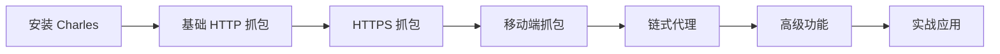

`# debug 的三种方法

## 使用 Chrome 调试 Node.js 程序

### 原理

开发者工具通过 WebSocket 与浏览器的 JavaScript 引擎通信
使用 Chrome DevTools Protocol 进行双向通信
调试器可以控制程序执行、检查变量、设置断点等

### 步骤

```zsh
node --inspect-brk index.js
node --inspect index.js
```

浏览器访问`chrome://inspect` `http://localhost:9229` 即可

## node 环境

### 原理

- Node.js 内置了 V8 调试器
- 基于 REPL（Read-Eval-Print Loop）

### 步骤

```zsh

```

然后在命令行中执行 next、step、continu、out 等命令

## vscode 调试

### 原理

- VS Code 作为调试客户端，通过 Debug Adapter Protocol (DAP) 与 Node.js 通信
- 底层使用 --inspect 协议
- 提供图形化界面 + 代码编辑器集成

### 步骤

```zsh
node --inspect-brk index.js
```

创建.vscode/launch.json

```json
{
  "version": "0.2.0",
  "configurations": [
    {
      "name": "Attach to Node",
      "type": "node",
      //   "request": "attach",
      "request": "launch", // 或 "attach"（附加到已运行的进程）
      "port": 9229,
      "skipFiles": [
        "<node_internals>/**", // 跳过 Node.js 内部代码
        "node_modules/**" // 跳过 node_modules
      ],
      "stopOnEntry": true // 在第一行暂停
    }
  ]
}
```

---

# Charles 抓包完整指南

## 一、Charles 简介

Charles 是一款强大的 HTTP/HTTPS 代理抓包工具，主要用于：

- 拦截和查看网络请求/响应
- 修改请求和响应内容
- 模拟慢速网络
- 重定向请求
- 断点调试

## 二、安装 Charles

### macOS 安装

1. **官网下载**

   - 访问 [https://www.charlesproxy.com/download/](https://www.charlesproxy.com/download/)
   - 下载 macOS 版本
   - 打开 `.dmg` 文件并拖拽到 Applications

2. **使用 Homebrew**

   ```zsh
   brew install --cask charles
   ```

3. **首次启动**
   - 打开 Charles
   - 会提示授权网络访问权限，点击"允许"
   - 试用版每次使用 30 分钟，可重启继续使用

## 三、基础配置

### 1. 设置系统代理

**自动设置（推荐）**

- 菜单栏：`Proxy` → `macOS Proxy`
- Charles 会自动配置系统代理为 `127.0.0.1:8888`

**手动设置**

- 系统偏好设置 → 网络 → 高级 → 代理
- 勾选 `HTTP代理` 和 `HTTPS代理`
- 服务器：`127.0.0.1`，端口：`8888`

### 2. 查看代理端口

- 菜单栏：`Proxy` → `Proxy Settings`
- 默认端口：`8888`
- 可以修改端口号（一般不需要）

### 3. 初始界面设置

**选择查看模式**

- `Structure` 模式：按域名分组显示
- `Sequence` 模式：按时间顺序显示

**过滤噪音**

- 右键某个域名 → `Focus` 只看这个域名
- 或者 `Proxy` → `Recording Settings` → `Include` 添加需要抓包的域名

## 四、HTTPS 抓包配置

### 1. 安装 Charles 根证书（Mac）

```zsh
# 步骤 1：安装证书
```

1. 菜单栏：`Help` → `SSL Proxying` → `Install Charles Root Certificate`
2. 会打开"钥匙串访问"，找到 "Charles Proxy CA..."
3. 双击证书，展开"信任"
4. "使用此证书时" 选择 "始终信任"
5. 关闭窗口，输入密码确认

```zsh
# 步骤 2：启用 SSL 代理
```

- 菜单栏：`Proxy` → `SSL Proxying Settings`
- 勾选 `Enable SSL Proxying`
- 点击 `Add` 添加需要抓包的域名
  - Host: `*`（抓取所有域名）或指定域名如 `*.google.com`
  - Port: `443`（HTTPS 默认端口）

### 2. 移动端 HTTPS 抓包配置

#### iOS 设备配置

**步骤 1：连接同一网络**

- 确保 Mac 和 iOS 设备在同一 WiFi 下

**步骤 2：获取 Mac IP 地址**

```zsh
ifconfig | grep "inet " | grep -v 127.0.0.1
```

或者在 Charles：`Help` → `Local IP Address`

**步骤 3：iOS 设置代理**

1. 设置 → WiFi → 点击当前连接的 WiFi 右侧的 `ⓘ`
2. 滚动到最下方 → HTTP 代理 → 手动
3. 服务器：填入 Mac 的 IP（如 `192.168.1.100`）
4. 端口：`8888`
5. 点击存储

**步骤 4：允许设备连接**

- 在 iOS 设备上打开任意网页
- Charles 会弹出提示框，点击 `Allow` 允许

**步骤 5：安装证书**

1. iOS Safari 浏览器访问：`chls.pro/ssl`
2. 下载配置描述文件，点击"允许"
3. 设置 → 已下载描述文件 → 安装（需要输入密码）
4. 设置 → 通用 → 关于本机 → 证书信任设置
5. 开启 "Charles Proxy CA" 的完全信任

#### Android 设备配置

**步骤 1-4：同 iOS**

**步骤 5：安装证书（Android 7.0+）**

1. 浏览器访问：`chls.pro/ssl`
2. 下载 `charles-ssl-proxying-certificate.pem`
3. 设置 → 安全 → 加密与凭据 → 从存储设备安装
4. 选择下载的证书文件
5. 为证书命名（如 Charles）

**Android 7.0+ 额外配置**

- 需要在 App 的 `AndroidManifest.xml` 中配置信任用户证书
- 或者使用 `android:networkSecurityConfig` 配置

## 五、常用功能

### 1. 断点调试（Breakpoints）

**设置断点**

- 找到要断点的请求，右键 → `Breakpoints`
- 或者：`Proxy` → `Breakpoint Settings` → `Add` 添加规则

**使用断点**

- 请求断点：修改请求参数、Headers 等
- 响应断点：修改返回数据
- 修改完成后点击 `Execute` 继续

### 2. 重写功能（Rewrite）

用于自动修改请求/响应，无需手动断点

```zsh
# 配置步骤
```

1. `Tools` → `Rewrite`
2. 勾选 `Enable Rewrite`
3. `Add` 添加规则集
4. 添加 Location（匹配规则）
5. 添加 Rewrite Rule（修改规则）

**常见修改类型**

- Modify Header：修改请求头
- Add Header：添加请求头
- Modify Response Body：修改响应内容
- Response Status：修改状态码

### 3. Map Local（本地映射）

将线上请求映射到本地文件

```zsh
# 使用场景：测试本地修改的 JS/CSS 文件
```

1. `Tools` → `Map Local`
2. `Add`
3. Map From：填写线上地址
4. Map To：选择本地文件路径

### 4. Map Remote（远程映射）

将一个远程地址映射到另一个远程地址

```zsh
# 使用场景：生产环境映射到测试环境
```

1. `Tools` → `Map Remote`
2. 配置 From 和 To 的地址

### 5. 限速功能（Throttling）

模拟慢速网络

```zsh
# 配置步骤
```

1. `Proxy` → `Throttle Settings`
2. 勾选 `Enable Throttling`
3. 选择预设（如 3G、4G）或自定义

### 6. 黑名单（Blocklist）

阻止某些请求

```zsh
# 配置步骤
```

1. `Proxy` → `Blocklist Settings`
2. `Add` 添加要阻止的域名或路径

## 六、链式代理配置（重点）

### 什么是链式代理？

链式代理是指 Charles 本身作为一个代理，但同时将流量转发给另一个代理服务器。这在以下场景非常有用：

- 公司内网需要通过公司代理访问外网
- 使用 VPN 或翻墙代理的同时进行抓包
- 多级代理环境

### 配置步骤

#### 1. 基础链式代理配置

```zsh
# 菜单操作
```

1. 打开 Charles
2. 菜单栏：`Proxy` → `External Proxy Settings`
3. 勾选 `Use external proxy servers`

#### 2. 配置 Web Proxy（HTTP/HTTPS 代理）

**场景：使用 Clash、V2Ray 等代理工具**

```zsh
# 配置项
```

- 勾选 `Web Proxy (HTTP)`
- Host：`127.0.0.1`（如果代理在本地）
- Port：填写你的代理端口（例如 Clash 默认 `7890`）
- 如需认证，填写 Username 和 Password

**Clash 示例**

```yaml
# 查看 Clash 的 HTTP 代理端口
# 打开 Clash → Settings → Port
# 通常为 7890
```

- Host: `127.0.0.1`
- Port: `7890`

**V2Ray 示例**

```json
# V2Ray 的 HTTP 入站端口，通常在配置文件中查看
```

- Host: `127.0.0.1`
- Port: `10809`（根据实际配置）

#### 3. 配置 SOCKS Proxy

**场景：使用 Shadowsocks、SSH 隧道等**

```zsh
# 配置项
```

- 勾选 `SOCKS Proxy`
- Host: `127.0.0.1`
- Port: SOCKS 代理端口（如 Shadowsocks 默认 `1080`）

**Shadowsocks 示例**

- Host: `127.0.0.1`
- Port: `1080`

**SSH 隧道示例**

```zsh
# 创建 SSH SOCKS 代理
ssh -D 1080 -N -f user@remote-server
```

- Host: `127.0.0.1`
- Port: `1080`

#### 4. 排除列表配置（Bypass）

某些地址不需要通过外部代理，直接从 Charles 出去

```zsh
# 场景：本地服务或局域网不走代理
```

在 `External Proxy Settings` 中：

- `Bypass external proxies for the following hosts:` 添加排除规则

**示例**

```
localhost
127.0.0.1
192.168.*
*.local
```

#### 5. 验证链式代理

**方法 1：检查 IP**

1. 配置链式代理后，访问 `https://api.ipify.org?format=json`
2. 在 Charles 中查看请求
3. 响应的 IP 应该是你的外部代理的 IP

**方法 2：访问特定网站**

- 访问需要代理才能访问的网站
- 在 Charles 中能看到请求，说明链式代理成功

### 链式代理高级配置

#### 1. 针对特定域名使用外部代理

```zsh
# 需求：只有某些域名走外部代理
```

1. `External Proxy Settings`
2. 移除全局的勾选
3. 点击 `Add` 添加域名规则
4. Location：填写域名（如 `*.google.com`）
5. 勾选相应的代理类型并配置

#### 2. 多个外部代理切换

虽然 Charles 不直接支持多个外部代理同时配置，但可以：

**方法 1：使用配置文件**

- 创建多个 Charles 配置文件
- 根据需要切换配置

**方法 2：使用 PAC 文件**
配置一个智能代理，然后 Charles 使用这个智能代理

#### 3. 公司代理 + VPN 场景

```zsh
# 常见企业环境配置
```

1. 公司通常有 HTTP 代理（如 `proxy.company.com:8080`）
2. 同时需要使用 VPN 访问外网

**配置示例**

```zsh
# External Proxy Settings
```

- Web Proxy (HTTP)

  - Host: `proxy.company.com`
  - Port: `8080`
  - Username/Password：公司代理账号

- SOCKS Proxy（如果有 VPN 提供 SOCKS）
  - 根据 VPN 配置填写

### 常见问题和解决方案

#### 1. 链式代理不生效

**检查清单**

```zsh
# 1. 确认外部代理正常运行
curl --proxy http://127.0.0.1:7890 https://www.google.com

# 2. 检查 Charles 是否启用了外部代理
# Proxy → External Proxy Settings → Use external proxy servers 是否勾选

# 3. 检查端口号是否正确
# 查看外部代理的实际监听端口

# 4. 查看 Charles 日志
# Window → Activity
```

#### 2. SSL 证书错误

```zsh
# 原因：某些外部代理会修改 SSL 证书
```

**解决方案**

- `Proxy` → `SSL Proxying Settings`
- 添加 `Exclude` 排除某些不需要 SSL 代理的域名

#### 3. 特定域名无法访问

```zsh
# 检查 Bypass 列表
```

- `External Proxy Settings` → `Bypass external proxies for...`
- 确保该域名没有被错误地排除

## 七、实战技巧

### 1. 抓包前的检查清单

```markdown
- [ ] Charles 正在运行
- [ ] macOS Proxy 已启用
- [ ] 如需 HTTPS：SSL Proxying 已启用并配置
- [ ] 如需链式代理：External Proxy 已正确配置
- [ ] 过滤器已设置（避免噪音干扰）
```

### 2. 快捷键

```zsh
⌘ + K    # 清空当前会话
⌘ + F    # 搜索
⌘ + R    # 开始/停止录制
⌘ + T    # 开启/关闭 Throttling
```

### 3. 导出数据

```zsh
# 导出会话
File → Export Session
# 支持格式：.chls, .har, .xml
```

### 4. 保存和复用配置

```zsh
# 保存当前配置
File → Save Session As...

# 下次直接打开
File → Open...
```

## 八、完整配置流程示例

### 场景：使用 Clash + Charles 抓取移动端 HTTPS 请求

```zsh
# 步骤 1：启动 Clash
# 确保 Clash HTTP 代理端口开启（默认 7890）

# 步骤 2：配置 Charles 链式代理
```

1. Charles → `Proxy` → `External Proxy Settings`
2. 勾选 `Use external proxy servers`
3. 勾选 `Web Proxy (HTTP)`
4. Host: `127.0.0.1`, Port: `7890`

```zsh
# 步骤 3：启用 macOS 系统代理
```

- `Proxy` → `macOS Proxy`

```zsh
# 步骤 4：配置 HTTPS 抓包
```

1. 安装 Charles 根证书（Mac）
2. `Proxy` → `SSL Proxying Settings` → `Enable SSL Proxying`
3. Add Location: Host `*`, Port `443`

```zsh
# 步骤 5：配置 iOS 设备
```

1. 查看 Mac IP：Charles → `Help` → `Local IP Address`
2. iOS WiFi 设置代理：服务器 `192.168.1.100`，端口 `8888`
3. Safari 访问 `chls.pro/ssl` 安装证书
4. 设置 → 证书信任设置 → 开启 Charles 证书

```zsh
# 步骤 6：验证
```

- 在 iOS 上访问 `https://www.google.com`
- Charles 中应该能看到完整的 HTTPS 请求内容
- 请求通过 Clash 代理转发

### 数据流向

```
iOS 设备
  ↓ (WiFi 代理: 192.168.1.100:8888)
Charles (Mac)
  ↓ (链式代理: 127.0.0.1:7890)
Clash
  ↓
外网服务器
```

## 九、总结

### 核心要点

1. **基础抓包**：启用 macOS Proxy，设置 SSL Proxying
2. **移动端抓包**：设备设置代理 + 安装证书
3. **链式代理**：External Proxy Settings 配置上游代理
4. **过滤噪音**：使用 Focus、Include、Exclude
5. **高级功能**：Breakpoints、Rewrite、Map Local

### 最佳实践

- 使用完 Charles 记得关闭系统代理
- 敏感信息不要保存在会话文件中
- 定期清理证书（移动端测试完成后）
- 合理使用过滤，提高效率
- 链式代理配置后记得验证

### 学习路线



---

**参考资源**

- 官方文档：[https://www.charlesproxy.com/documentation/](https://www.charlesproxy.com/documentation/)
- SSL 证书安装：[https://www.charlesproxy.com/documentation/using-charles/ssl-certificates/](https://www.charlesproxy.com/documentation/using-charles/ssl-certificates/)
