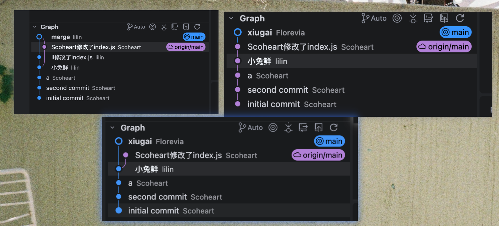

## git

### 什么是 git 仓库？

git 仓库就是放代码的地方

### git status

查看仓库信息

### git init

初始化/创建一个本地仓库

### git add + filename

### git add -A (git add -all)

```sh
# 提交全部文件
git add -A

# 提交该目录下全部文件
git add .
```

提交到缓冲区，提交冷静期

---

### git commit -m "备注信息"

```sh
git commit -m "我写了个 shell.md，把它提交到 git 仓库"
```

---

### git log

查看提交记录

---

### git branch

查看当前分支

### git branch -r

看远程分支列表

### git branch -a

查看全部分支 远程+本地

### git branch -vv

查看分支详情或上游关系

### git branch <分支名>

新建分支

本地仓库、main 分支 进行代码开发

远程仓库（github）、 无分支 保存代码

---

### git switch + 分支名

转换到其他分支

### git switch -c <分支名>

创建并转换到其他分支

---

### git branch + git checkout /

创建分支并转到该分支上

---

### git remote

将本地仓库与远程仓库建立连接

```sh
git remote add <r-github/origin> <git@github.com:Florevia/notes.git/(url)>
```

### git remote -v

查看当前 git 仓库的远程仓库名

---

### git push

```sh
git push <remote_repo_name> <local_branch_name：remote_branch_name>
```

将本地仓库分支内容推到远程仓库

```sh
git push -u <remote_repo_name> <branch_name：remote_branch_name>
```

-u（--set-upstream）: 在远程仓库建立分支,两仓库分支创立链接

git push: 并推到远程仓库分支上

---

### git push （origin） --delete （feature）

删除远程分支

### git checkout/switch

检出/转换分支

---

### git fetch --prune

同步远程分支变化,更新远程列表

---

### git clone

往本地拿远程仓库内容

```sh
git clone -b main --single-branch <repo-url>
# 只下载（克隆）main 分支

git clone <repo-url>
# 下载（克隆）所有分支
```

---

### git fetch `url`

## 将远程内容拉到本地

### git rebase origin/main

将远程更新 线性对齐主干（线性）

- 例：将A变基到B：
 git switch A --> git A rebase B

### git merge origin/main

将远程更新 合并 （有分支）

- 例： 把B合并到A：
 git switch A --> git A merge B
 

```sh
# 同步远程信息（不动工作区）
git fetch origin

# 切到你的功能分支（若已在则略过）
git switch feature/login

# 把当前分支变基到远程最新的主干上（或变基到对应的远程跟踪分支）
git rebase origin/main

```


