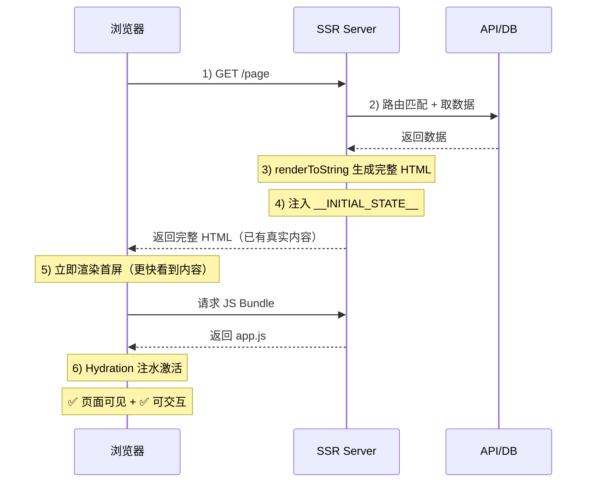
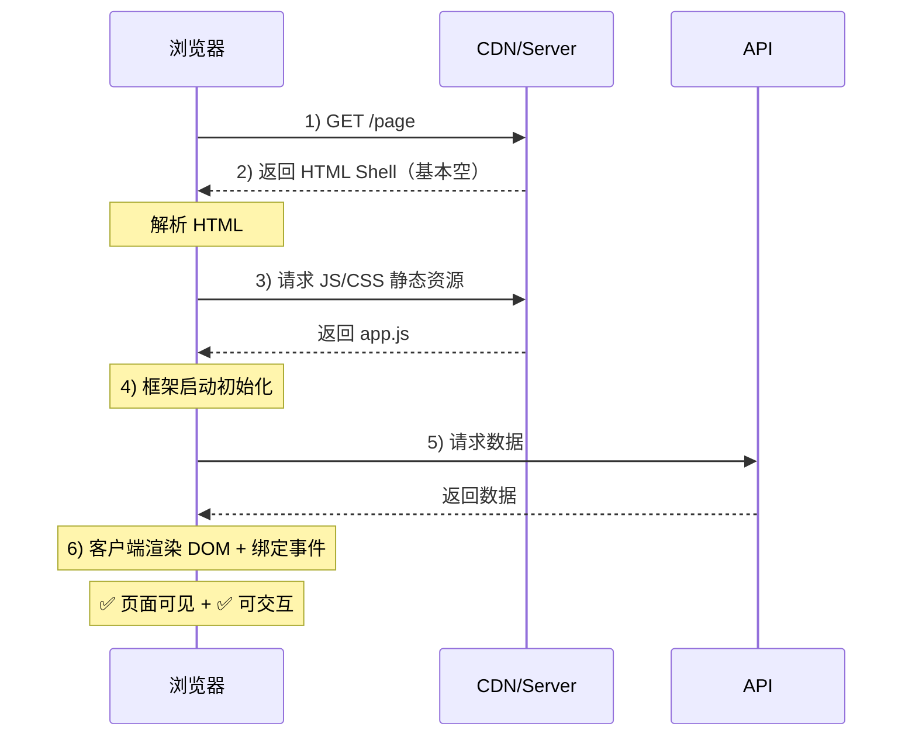

# 前端渲染模式

## 服务端渲染

1. 服务器压力大
2. 首屏加载速度快
3. SEO 优化

### 服务端渲染流程

- SSR 的核心：服务器先把“完整 HTML 内容”渲染好再返回，浏览器拿到 HTML 就能更快看到真实内容；但要“能点能交互”，通常还需要客户端 JS 做 Hydration（注水/激活）

---

## 客户端渲染

1. 首屏加载速度快
2. SEO 优化
3. 服务器压力大

### 客户端渲染流程

- CSR 的核心：服务器先返回一个很“空”的 HTML 壳子，真正的页面结构和内容主要由 浏览器下载 JS 后在客户端生成。

