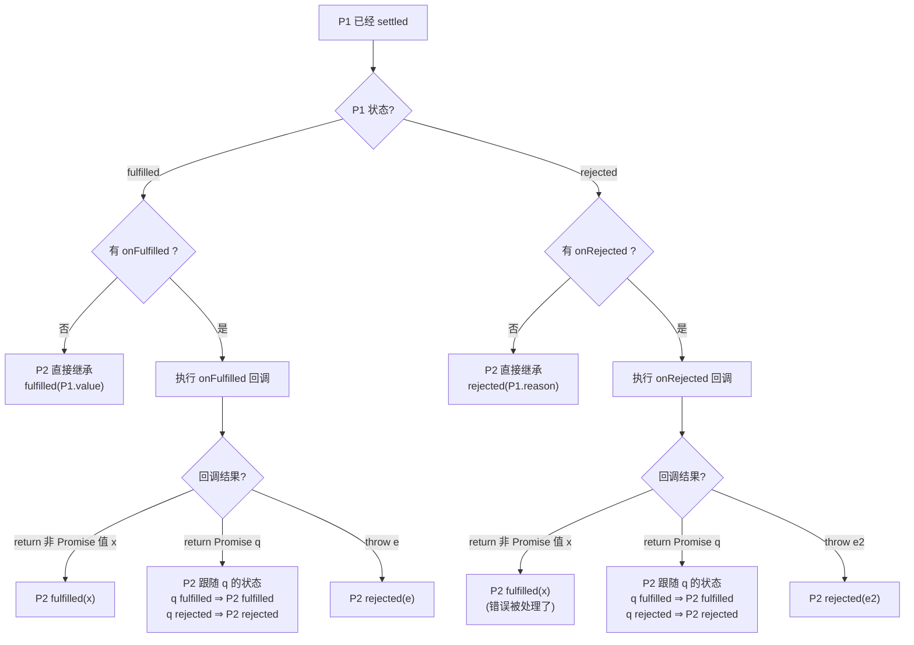
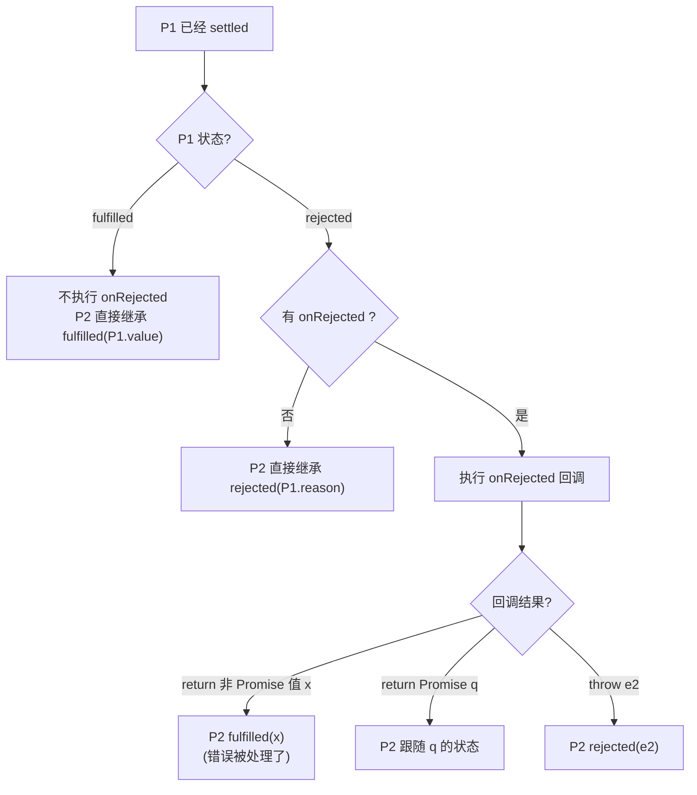
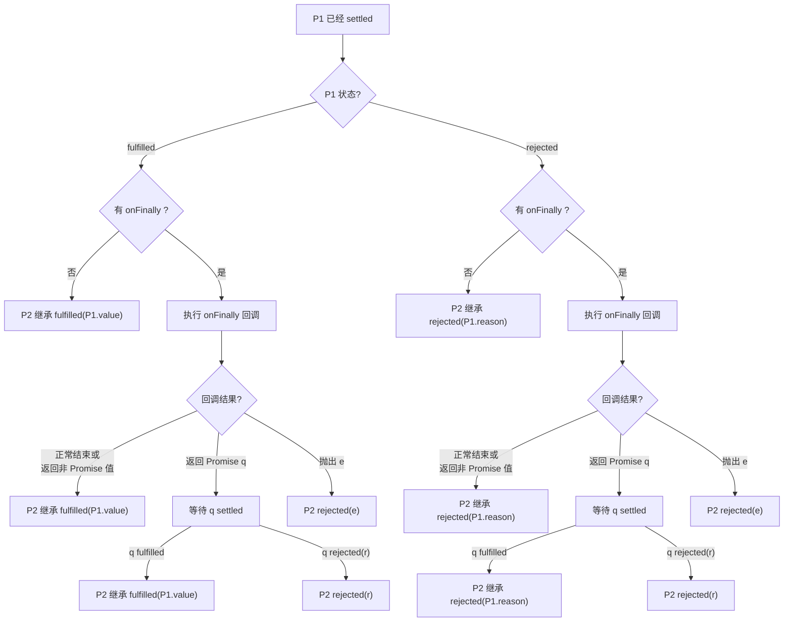

# Promise

### 三种状态

- **pending**（进行中）：初始状态
- **fulfilled**（已成功）：操作成功完成
- **rejected**（已失败）：操作失败

> [!IMPORTANT] > **状态不可逆！** 一旦从 pending 变为 fulfilled 或 rejected，状态就不会再改变。

```js
const promise = new Promise((resolve, reject) => {
  // resolve 和 reject 只会生效一次
  resolve("success");
  reject("error"); // 这行不会执行，因为状态已经改变
});
```

---

## Promise 基本用法

### 创建 Promise

```js
const promise = new Promise((resolve, reject) => {
  // 异步操作
  setTimeout(() => {
    const success = true;
    if (success) {
      resolve("操作成功");
    } else {
      reject("操作失败");
    }
  }, 1000);
});
```

### 使用 Promise

```js
promise
  .then((result) => {
    console.log(result); // 处理成功
  })
  .catch((error) => {
    console.log(error); // 处理失败
  })
  .finally(() => {
    console.log("无论成功失败都会执行");
  });
```

---

## Promise 状态传递

### then



### catch



### finally



---

## Promise 静态方法

### Promise.resolve(value)

将值转换为 fulfilled 的 Promise。

```js
// 普通值
Promise.resolve(42); // Promise {fulfilled: 42}

// 已是 Promise，直接返回
const p = Promise.resolve(1);
Promise.resolve(p) === p; // true

// thenable 对象
const thenable = {
  then(resolve) {
    resolve("thenable result");
  },
};
Promise.resolve(thenable).then(console.log); // 'thenable result'
```

### Promise.reject(reason)

创建一个 rejected 的 Promise。

```js
Promise.reject(new Error("失败")).catch((e) => console.log(e.message)); // '失败'
```

### Promise.all(iterable)

所有 Promise 都成功才成功，任一失败则失败。

```js
const p1 = Promise.resolve(1);
const p2 = Promise.resolve(2);
const p3 = Promise.resolve(3);

Promise.all([p1, p2, p3])
  .then((values) => console.log(values)) // [1, 2, 3]
  .catch((error) => console.log(error));

// 有一个失败
const p4 = Promise.reject("error");
Promise.all([p1, p2, p4])
  .then((values) => console.log(values))
  .catch((error) => console.log(error)); // 'error'
```

### Promise.race(iterable)

返回第一个 settled 的 Promise 结果（无论成功失败）。

```js
const fast = new Promise((resolve) => setTimeout(() => resolve("快"), 100));
const slow = new Promise((resolve) => setTimeout(() => resolve("慢"), 500));

Promise.race([fast, slow]).then(console.log); // '快'
```

### Promise.allSettled(iterable)

等待所有 Promise 都 settled，返回每个结果状态。

```js
const p1 = Promise.resolve(1);
const p2 = Promise.reject("error");

Promise.allSettled([p1, p2]).then(console.log);
// [
//   { status: 'fulfilled', value: 1 },
//   { status: 'rejected', reason: 'error' }
// ]
```

### Promise.any(iterable)

返回第一个成功的 Promise，全部失败才失败。

```js
const p1 = Promise.reject("error1");
const p2 = Promise.resolve("success");
const p3 = Promise.reject("error2");

Promise.any([p1, p2, p3]).then(console.log); // 'success'

// 全部失败
Promise.any([p1, p3]).catch((e) => {
  console.log(e); // AggregateError: All promises were rejected
  console.log(e.errors); // ['error1', 'error2']
});
```

---

## 常见面试题

### 1. 基础输出题

```js
console.log(1);

setTimeout(() => {
  console.log(2);
}, 0);

Promise.resolve()
  .then(() => {
    console.log(3);
  })
  .then(() => {
    console.log(4);
  });

console.log(5);
```

**答案**: `1, 5, 3, 4, 2`

**解析**:

- 同步代码先执行：1, 5
- Promise.then 是微任务，先执行：3, 4
- setTimeout 是宏任务，最后执行：2

---

### 2. Promise 构造函数执行时机

```js
const promise = new Promise((resolve, reject) => {
  console.log(1);
  resolve();
  console.log(2);
});

promise.then(() => {
  console.log(3);
});

console.log(4);
```

**答案**: `1, 2, 4, 3`

**解析**:

- Promise 构造函数是同步执行的
- resolve() 后面的代码仍会执行
- then 回调是异步的（微任务）

---

### 3. resolve 传入 Promise

```js
const p1 = new Promise((resolve) => {
  setTimeout(() => {
    resolve("p1");
  }, 1000);
});

const p2 = new Promise((resolve) => {
  setTimeout(() => {
    resolve(p1); // resolve 传入另一个 Promise
  }, 500);
});

p2.then((res) => console.log(res)); // 'p1' (1秒后输出)
```

**解析**: 当 `resolve(promise)` 时，会等待传入的 Promise settled 后，采用其状态和值。

---

### 4. then 的返回值

```js
Promise.resolve(1)
  .then((res) => {
    console.log(res); // 1
    return 2;
  })
  .then((res) => {
    console.log(res); // 2
  })
  .then((res) => {
    console.log(res); // undefined
  });
```

---

### 5. catch 的位置影响

```js
// 情况1
Promise.resolve()
  .then(() => {
    throw new Error("error");
  })
  .catch((e) => console.log("caught:", e.message))
  .then(() => console.log("继续执行"));

// 输出: 'caught: error', '继续执行'

// 情况2
Promise.resolve()
  .then(
    () => {
      throw new Error("error");
    },
    (e) => console.log("onRejected:", e.message)
  )
  .then(() => console.log("继续执行"));

// 输出: Uncaught Error (then 的第二个参数无法捕获第一个参数的错误)
```

---

### 6. 链式调用中的错误处理

```js
Promise.reject("error")
  .then((res) => console.log("then1:", res))
  .catch((err) => {
    console.log("catch:", err);
    return "recovered";
  })
  .then((res) => console.log("then2:", res));

// 输出:
// 'catch: error'
// 'then2: recovered'
```

**解析**: catch 处理错误后返回值，后续 then 接收该返回值。

---

### 7. finally 的特性

```js
Promise.resolve("success")
  .finally(() => {
    console.log("finally");
    return "finally return"; // 返回值被忽略
  })
  .then((res) => console.log("then:", res));

// 输出:
// 'finally'
// 'then: success' (不是 'finally return')
```

**解析**: finally 的返回值不会传递给后续 then（除非抛出错误或返回 rejected Promise）。

---

### 8. Promise.all 的执行顺序

```js
const p1 = new Promise((resolve) => {
  setTimeout(() => {
    console.log("p1");
    resolve(1);
  }, 1000);
});

const p2 = new Promise((resolve) => {
  setTimeout(() => {
    console.log("p2");
    resolve(2);
  }, 500);
});

Promise.all([p1, p2]).then((res) => console.log(res));

// 输出:
// 'p2' (500ms 后)
// 'p1' (1000ms 后)
// [1, 2] (结果顺序与传入顺序一致)
```

---

### 9. async/await 与 Promise

```js
async function async1() {
  console.log("async1 start");
  await async2();
  console.log("async1 end");
}

async function async2() {
  console.log("async2");
}

console.log("script start");
async1();
console.log("script end");

// 输出:
// 'script start'
// 'async1 start'
// 'async2'
// 'script end'
// 'async1 end'
```

**解析**: `await` 后面的代码相当于在 `.then()` 中执行，是微任务。

---

### 10. 综合题

```js
console.log("start");

setTimeout(() => console.log("setTimeout"), 0);

Promise.resolve()
  .then(() => console.log("promise1"))
  .then(() => console.log("promise2"));

new Promise((resolve) => {
  console.log("promise3");
  resolve();
}).then(() => console.log("promise4"));

console.log("end");
```

**答案**: `start, promise3, end, promise1, promise4, promise2, setTimeout`

---

## 手写 Promise

### 简易版实现

```js
class MyPromise {
  static PENDING = "pending";
  static FULFILLED = "fulfilled";
  static REJECTED = "rejected";

  constructor(executor) {
    this.status = MyPromise.PENDING;
    this.value = undefined;
    this.reason = undefined;
    this.onFulfilledCallbacks = [];
    this.onRejectedCallbacks = [];

    const resolve = (value) => {
      if (this.status === MyPromise.PENDING) {
        this.status = MyPromise.FULFILLED;
        this.value = value;
        this.onFulfilledCallbacks.forEach((fn) => fn());
      }
    };

    const reject = (reason) => {
      if (this.status === MyPromise.PENDING) {
        this.status = MyPromise.REJECTED;
        this.reason = reason;
        this.onRejectedCallbacks.forEach((fn) => fn());
      }
    };

    try {
      executor(resolve, reject);
    } catch (error) {
      reject(error);
    }
  }

  then(onFulfilled, onRejected) {
    // 值穿透
    onFulfilled =
      typeof onFulfilled === "function" ? onFulfilled : (value) => value;
    onRejected =
      typeof onRejected === "function"
        ? onRejected
        : (reason) => {
            throw reason;
          };

    const promise2 = new MyPromise((resolve, reject) => {
      const fulfilledMicrotask = () => {
        queueMicrotask(() => {
          try {
            const x = onFulfilled(this.value);
            this.resolvePromise(promise2, x, resolve, reject);
          } catch (error) {
            reject(error);
          }
        });
      };

      const rejectedMicrotask = () => {
        queueMicrotask(() => {
          try {
            const x = onRejected(this.reason);
            this.resolvePromise(promise2, x, resolve, reject);
          } catch (error) {
            reject(error);
          }
        });
      };

      if (this.status === MyPromise.FULFILLED) {
        fulfilledMicrotask();
      } else if (this.status === MyPromise.REJECTED) {
        rejectedMicrotask();
      } else {
        this.onFulfilledCallbacks.push(fulfilledMicrotask);
        this.onRejectedCallbacks.push(rejectedMicrotask);
      }
    });

    return promise2;
  }

  resolvePromise(promise2, x, resolve, reject) {
    if (promise2 === x) {
      return reject(new TypeError("Chaining cycle detected"));
    }

    if (x instanceof MyPromise) {
      x.then(resolve, reject);
    } else {
      resolve(x);
    }
  }

  catch(onRejected) {
    return this.then(null, onRejected);
  }

  finally(onFinally) {
    return this.then(
      (value) => MyPromise.resolve(onFinally()).then(() => value),
      (reason) =>
        MyPromise.resolve(onFinally()).then(() => {
          throw reason;
        })
    );
  }

  static resolve(value) {
    if (value instanceof MyPromise) return value;
    return new MyPromise((resolve) => resolve(value));
  }

  static reject(reason) {
    return new MyPromise((_, reject) => reject(reason));
  }

  static all(promises) {
    return new MyPromise((resolve, reject) => {
      const results = [];
      let count = 0;

      if (promises.length === 0) {
        return resolve(results);
      }

      promises.forEach((promise, index) => {
        MyPromise.resolve(promise).then(
          (value) => {
            results[index] = value;
            count++;
            if (count === promises.length) {
              resolve(results);
            }
          },
          (reason) => {
            reject(reason);
          }
        );
      });
    });
  }

  static race(promises) {
    return new MyPromise((resolve, reject) => {
      promises.forEach((promise) => {
        MyPromise.resolve(promise).then(resolve, reject);
      });
    });
  }
}
```

---

## 实用场景

### 1. 并发请求控制

```js
async function limitConcurrency(tasks, limit) {
  const results = [];
  const executing = [];

  for (const task of tasks) {
    const p = Promise.resolve().then(() => task());
    results.push(p);

    if (tasks.length >= limit) {
      const e = p.then(() => executing.splice(executing.indexOf(e), 1));
      executing.push(e);
      if (executing.length >= limit) {
        await Promise.race(executing);
      }
    }
  }

  return Promise.all(results);
}
```

### 2. 超时处理

```js
function promiseWithTimeout(promise, timeout) {
  const timeoutPromise = new Promise((_, reject) => {
    setTimeout(() => reject(new Error("Timeout")), timeout);
  });

  return Promise.race([promise, timeoutPromise]);
}

// 使用
promiseWithTimeout(fetch("/api/data"), 5000)
  .then((response) => response.json())
  .catch((error) => console.log(error.message));
```

### 3. 重试机制

```js
async function retry(fn, retries = 3, delay = 1000) {
  for (let i = 0; i < retries; i++) {
    try {
      return await fn();
    } catch (error) {
      if (i === retries - 1) throw error;
      await new Promise((r) => setTimeout(r, delay));
    }
  }
}

// 使用
retry(() => fetch("/api/data"), 3, 1000)
  .then((response) => response.json())
  .catch((error) => console.log("所有重试都失败"));
```

---

## 总结

| 方法                 | 说明             | 返回时机                  |
| -------------------- | ---------------- | ------------------------- |
| `Promise.all`        | 所有成功才成功   | 全部 fulfilled / 首个失败 |
| `Promise.race`       | 取最快的结果     | 首个 settled              |
| `Promise.allSettled` | 获取所有结果状态 | 全部 settled              |
| `Promise.any`        | 取第一个成功     | 首个 fulfilled / 全部失败 |

**核心要点**:

1. Promise 状态不可逆
2. 构造函数同步执行，then/catch/finally 异步执行（微任务）
3. then 返回新 Promise，支持链式调用
4. catch 能捕获前面所有的错误
5. finally 不接收参数，返回值被忽略（除非抛错）
