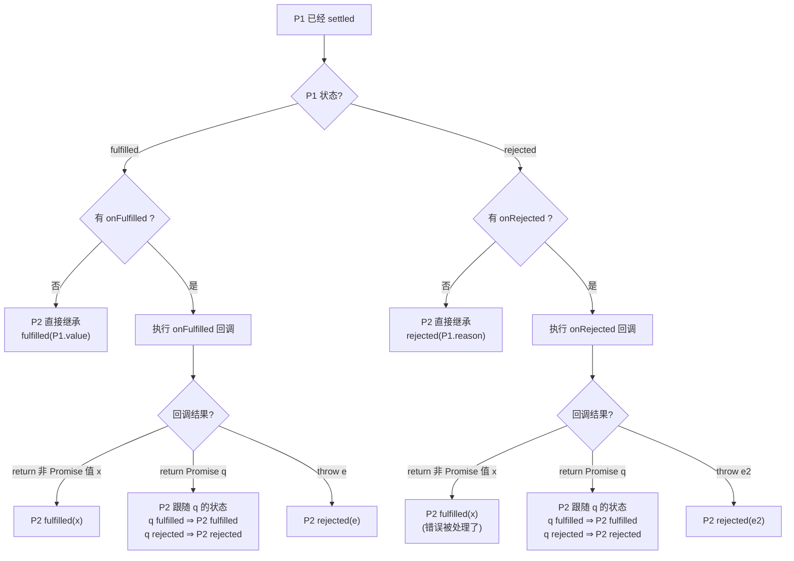
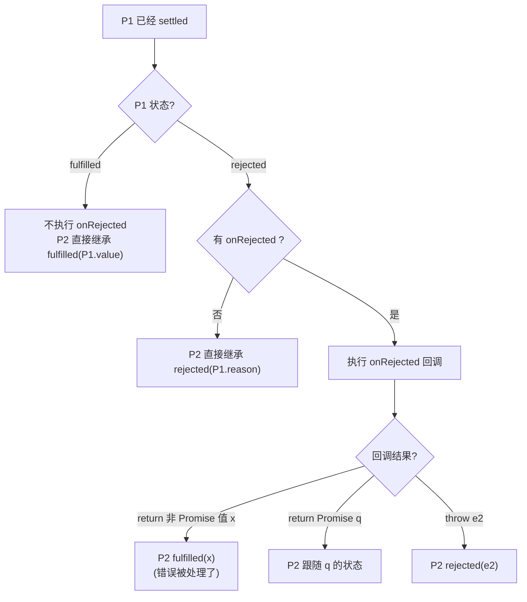
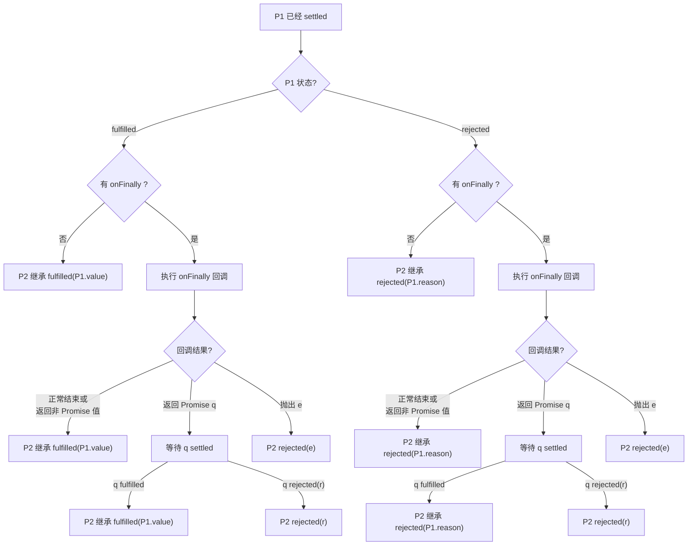

# Promise

### 三种状态

- **pending**（进行中）：初始状态
- **fulfilled**（已成功）：操作成功完成
- **rejected**（已失败）：操作失败

> [!IMPORTANT] > **状态不可逆！** 一旦从 pending 变为 fulfilled 或 rejected，状态就不会再改变。

```js
const promise = new Promise((resolve, reject) => {
  // resolve 和 reject 只会生效一次
  resolve("success");
  reject("error"); // 这行不会执行，因为状态已经改变
});
```

---

## Promise 基本用法

### 创建 Promise

```js
const promise = new Promise((resolve, reject) => {
  // 异步操作
  setTimeout(() => {
    const success = true;
    if (success) {
      resolve("操作成功");
    } else {
      reject("操作失败");
    }
  }, 1000);
});
```

### 使用 Promise

```js
promise
  .then((result) => {
    console.log(result); // 处理成功
  })
  .catch((error) => {
    console.log(error); // 处理失败
  })
  .finally(() => {
    console.log("无论成功失败都会执行");
  });
```

---

## Promise 状态传递

### then



### catch



### finally



---

## Promise 静态方法

- Promise.resolve(value)
- Promise.reject(reason)
- Promise.all(iterable)
- Promise.race(iterable)
- Promise.allSettled(iterable)
- Promise.any(iterable)

## 常见面试题

### Promise 构造函数执行时机

```js
const promise = new Promise((resolve, reject) => {
  // Promise 构造函数是同步执行的
  console.log(1);
  resolve(); // resolve() 后面的代码仍会执行
  console.log(2);
});

promise.then(() => {
  //then 回调是异步的（微任务）
  console.log(3);
});

console.log(4);
```

**答案**: `1, 2, 4, 3`

---

### resolve 传入 Promise

```js
const p1 = new Promise((resolve) => {
  setTimeout(() => {
    resolve("p1");
  }, 1000);
});

const p2 = new Promise((resolve) => {
  setTimeout(() => {
    resolve(p1); // resolve 传入另一个 Promise
  }, 500);
});

p2.then((res) => console.log(res)); // 'p1' (                           1秒后输出)
```

**解析**: 当 `resolve(promise)` 时，会等待传入的 Promise settled 后，采用其状态和值。

---

### Promise 构造器中抛错 vs resolve(Promise.reject())

```js
// 情况 A
const pA = new Promise((resolve) => {
  resolve(Promise.reject("error A"));
});

// 情况 B
const pB = new Promise((resolve, reject) => {
  reject("error B");
});

// 情况 C
const pC = new Promise(() => {
  throw "error C";
});

pA.catch((e) => console.log("A:", e));
pB.catch((e) => console.log("B:", e));
pC.catch((e) => console.log("C:", e));
// B: error B
// C: error C
// A: error A
```

---

### 微任务时序（高频考点）

```js
Promise.resolve()
  .then(() => {
    console.log(1);
    return Promise.resolve(2); // 返回一个 fulfilled Promise
  })
  .then((res) => {
    console.log(res);
  });

Promise.resolve()
  .then(() => {
    console.log(3);
  })
  .then(() => {
    console.log(4);
  })
  .then(() => {
    console.log(5);
  });
  .then(() => {
    console.log(6);
  });
// 1 3 4 5 2
```

---

### resolve(promise) vs return promise

```js
const p1 = new Promise((resolve) => {
  setTimeout(() => resolve("p1"), 1000);
});

const p2 = new Promise((resolve) => {
  resolve(p1);
});

const p3 = Promise.resolve().then(() => p1);

p2.then((res) => console.log("p2:", res));
p3.then((res) => console.log("p3:", res));

console.log("p2 === p1:", p2 === p1);
console.log("p3 === p1:", p3 === p1);
```

**输出**:

```text
p2 === p1: false
p3 === p1: false
p2: p1
p3: p1
```

**核心解析**:

1.  **引用不相等**:

    - `p1` 是源 Promise。
    - `p2` 是 `new Promise` 创建的新实例。即使 `resolve(p1)`，它也只是锁定状态，而非返回同一个对象。
    - `p3` 是 `.then()` 返回的新实例。
    - 所以 `p2 !== p1` 且 `p3 !== p1`。

2.  **执行顺序 (p2 先于 p3)**:
    - `p2` 在构造函数中直接 `resolve(p1)`。这是一个同步操作（或非常早的订阅），`p2` 立即订阅了 `p1` 的状态。
    - `p3` 通过 `Promise.resolve().then(() => p1)` 创建。这是一个**微任务**。只有当这个微任务执行时，回调函数 `() => p1` 被调用，`p3` 才开始订阅 `p1`。
    - 因此，`p2` 比 `p3` 更早进入 `p1` 的等待队列。
    - 当 1 秒后 `p1` settled (fulfilled) 时，它会按顺序通知订阅者：先 `p2`，后 `p3`。
    - 所以 `p2` 的回调先执行，`p3` 的回调后执行。

---

### async/await 与 Promise

```js
async function async1() {
  console.log("async1 start");
  await async2();
  console.log("async1 end");
}

async function async2() {
  console.log("async2");
}

console.log("script start");
async1();
console.log("script end");

// 输出:
// 'script start'
// 'async1 start'
// 'async2'
// 'script end'
// 'async1 end'
```

**解析**: `await` 后面的代码相当于在 `.then()` 中执行，是微任务。

---

### 10. 综合题

```js
console.log("start");

setTimeout(() => console.log("setTimeout"), 0);

Promise.resolve()
  .then(() => console.log("promise1"))
  .then(() => console.log("promise2"));

new Promise((resolve) => {
  console.log("promise3");
  resolve();
}).then(() => console.log("promise4"));

console.log("end");
```

**答案**: `start, promise3, end, promise1, promise4, promise2, setTimeout`

---

## 手写 Promise.all()

- 实现要点：

  - 输入检查：先判断是否为数组。
  - 结果顺序：使用 results[index] = value 确保结果数组的顺序与入参 Promise 顺序一致，而不是谁先完成谁先排进去。
  - 错误处理：只要有一个 Promise 失败，reject 立即触发（Fail-fast）。
  - 计数器：使用 count 记录成功的数量，当 count === len 时才最终 resolve。
  - 兼容性：使用 Promise.resolve(p) 包裹每一项，确保数组中包含非 Promise 值时也能正常处理。

- 实现代码：

```js
function promiseAll(promises) {
  return new Promise((resolve, reject) => {
    if (!Array.isArray(promises)) {
      return reject(new TypeError("Argument must be an array"));
    }

    const results = [];
    let count = 0;
    const len = promises.length;

    if (len === 0) {
      return resolve(results);
    }

    promises.forEach((p, index) => {
      // Promise.resolve 包裹，确保处理非 Promise 值
      Promise.resolve(p).then(
        (value) => {
          results[index] = value; // 保持原有顺序
          count++;
          if (count === len) {
            resolve(results); // 全部成功
          }
        },
        (error) => {
          reject(error); // 只要有一个失败，立刻失败
        }
      );
    });
  });
}

// 测试代码
const p1 = Promise.resolve(1);
const p2 = new Promise((resolve) => setTimeout(() => resolve(2), 1000));
const p3 = Promise.resolve(3);

promiseAll([p1, p2, p3]).then(console.log).catch(console.error);
// 1秒后输出 [1, 2, 3]

promiseAll([p1, Promise.reject("error"), p3])
  .then(console.log)
  .catch(console.error);
// 输出 'error'
```
