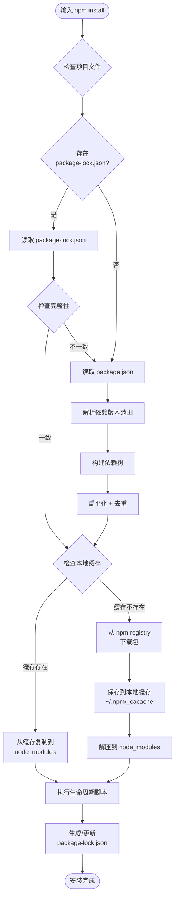
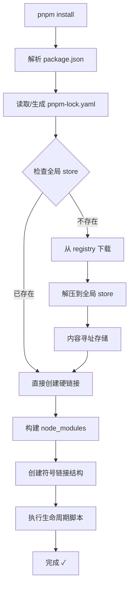

## npm install



### 检查完整性

- 验证缓存中的包文件是否完整、未被篡改或损坏。npm 使用 hash 值来校验文件完整性。

### 扁平化

- 把所有依赖，包括依赖的依赖都提升至顶层 node_modules 中。
- 这样 import 在找依赖包的时候，在自己的文件夹里找不到，会到 node_modules 里找

---

## pnpm install



---

### pnpm 的核心特性：Content-Addressable Store（内容寻址存储）

- 用文件的哈希值来找文件

---

### 并行下载

- 串行下载（Sequential）：

```text
时间轴 ─────────────────────────────────────────→

下载 lodash
|████████|
          下载 express
          |████████████|
                        下载 axios
                        |██████|

总时间 = lodash + express + axios
```

- 并行下载（Parallel）：

```text
时间轴 ───────────────────→

下载 lodash    |████████|
下载 express   |████████████|
下载 axios     |██████|

总时间 ≈ max(lodash, express, axios)
```
